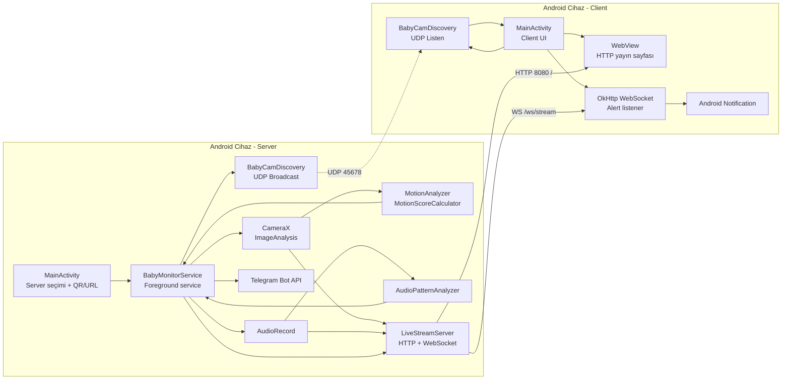

# BabyCam

BabyCam, bir Android cihazı **yerel ağ üzerinden bebek kamerası server'ı** olarak çalıştırıp diğer Android cihazların **client** olarak aynı yayını izlemesini sağlayan CameraX tabanlı bir bebek takip uygulamasıdır. Server cihaz kamera ve mikrofonu kullanır; video, ses ve alarm olaylarını LAN üzerinden yayınlar. Client cihazlar aynı ağda server'ı otomatik bulabilir, video/ses yayınını izleyebilir ve server'ın ürettiği uyarıları native Android bildirimi olarak alabilir.

> Kısa özet: Bir cihazı bebek odasına koyup **Server** seçersiniz. Diğer cihazlarda **Client** seçilir; uygulama server'ı ağda bulur veya QR/URL ile bağlanır. Server hareket/ses analizi yapar, stream yayınlar ve alarm durumunda hem Telegram'a hem de bağlı client'lara uyarı gönderir.

---

## İçindekiler

- [Temel özellikler](#temel-özellikler)
- [Uygulama rolleri](#uygulama-rolleri)
- [Yüksek seviye mimari](#yüksek-seviye-mimari)
- [Modül ve dosya haritası](#modül-ve-dosya-haritası)
- [Server akışı](#server-akışı)
- [Client akışı](#client-akışı)
- [Ağ protokolü](#ağ-protokolü)
- [Video ve ses aktarımı](#video-ve-ses-aktarımı)
- [Hareket ve ses analizi](#hareket-ve-ses-analizi)
- [Bildirim mimarisi](#bildirim-mimarisi)
- [Konfigürasyon](#konfigürasyon)
- [İzinler ve Android servis modeli](#izinler-ve-android-servis-modeli)
- [UI mimarisi](#ui-mimarisi)
- [Build ve çalıştırma](#build-ve-çalıştırma)
- [Debug ve sorun giderme](#debug-ve-sorun-giderme)
- [Geliştirme notları](#geliştirme-notları)

---

## Temel özellikler

- **Server/Client ilk giriş seçimi**
  - Server: Kamera, mikrofon, hareket/ses analizi, canlı yayın, Telegram ve client uyarıları.
  - Client: Aynı ağdaki server'ı keşfeder, yayını izler, uyarıları Android bildirimi olarak alır.
- **CameraX ile canlı video analizi**
  - Arka kamera seçilir.
  - Kareler hareket analizi için işlenir.
  - Yayın için JPEG/MJPEG akışına çevrilir.
- **Mikrofon ile canlı ses analizi ve yayın**
  - PCM16LE mono ses yakalanır.
  - Ağlama benzeri ses skoru hesaplanır.
  - Ses stream'i HTTP/WebSocket üzerinden client'lara iletilir.
- **Yerel ağ yayını**
  - HTTP portu: `8080`.
  - Web arayüzü: `http://<server-ip>:8080/`.
  - MJPEG endpoint: `/video`.
  - WAV/PCM endpoint: `/audio`.
  - birleşik WebSocket endpoint: `/ws/stream`.
- **LAN discovery**
  - UDP broadcast portu: `45678`.
  - Server kendi adresini periyodik yayınlar.
  - Client aynı portu dinleyerek server'ı otomatik bulur.
- **QR/URL paylaşımı**
  - Server modunda yerel yayın URL'si gösterilir.
  - Aynı URL için QR kod üretilir.
- **Telegram + local client bildirimleri**
  - Server kritik olayları Telegram'a gönderebilir.
  - Bağlı client'lara ayrıca WebSocket alert paketi gönderilir.

---

## Uygulama rolleri

### Server modu

Server modu bebek odasına koyulacak cihaz içindir.

Server'ın görevleri:

1. Kamera ve mikrofon izinlerini ister.
2. `BabyMonitorService` foreground service olarak başlar.
3. Wake lock alarak arka planda canlı kalmaya çalışır.
4. CameraX ile görüntü alır.
5. `AudioRecord` ile mikrofon verisi alır.
6. Video/ses analizini yapar.
7. `LiveStreamServer` ile HTTP/WebSocket yayını başlatır.
8. UDP discovery broadcast'i ile client'lara kendini duyurur.
9. Alarm oluşursa:
   - Telegram mesajı gönderir.
   - WebSocket ile bağlı client'lara alert gönderir.

### Client modu

Client modu ebeveyn cihazı veya yayını izleyecek diğer cihazlar içindir.

Client'ın görevleri:

1. Server discovery dinlemesini başlatır.
2. Server bulunursa adres alanını otomatik doldurur.
3. WebView ile `http://<server>:8080/` sayfasını açar.
4. Ayrı bir native WebSocket bağlantısıyla alert paketlerini dinler.
5. Alert geldiğinde Android bildirimi gösterir.
6. Kullanıcı isterse server adresini manuel girebilir.

---

## Yüksek seviye mimari



> Not: Mermaid diyagramı GitHub gibi destekleyen ortamlarda görsel olarak render edilir. Desteklemeyen editörlerde kod bloğu olarak görünür.

---

## Modül ve dosya haritası

### Android giriş noktaları

| Dosya | Sorumluluk |
| --- | --- |
| `MainActivity.kt` | Rol seçimi, server/client UI, client WebView, QR üretimi, client alert WebSocket'i, notification channel. |
| `BabyMonitorService.kt` | Server'ın ana foreground service'i; kamera, mikrofon, analiz, streaming, Telegram ve discovery entegrasyonu. |
| `AndroidManifest.xml` | Kamera/mikrofon/internet/foreground service/notification izinleri ve service tanımı. |
| `activity_main.xml` | Rol seçimi, server QR/URL paneli, client discovery/adres paneli, WebView ve log paneli. |

### Ağ ve protokol

| Dosya | Sorumluluk |
| --- | --- |
| `BabyCamProtocol.kt` | HTTP portu, discovery portu, servis adı, WebSocket paket tipleri ve discovery payload formatı. |
| `BabyCamDiscovery.kt` | UDP broadcast ve UDP listener coroutine işleri. |
| `NetworkAddressProvider.kt` | Yerel IPv4 adresini bulup `ip:port` formatında döndürür. |
| `LiveStreamServer.kt` | Gömülü HTTP server, MJPEG video, WAV/PCM ses, WebSocket AV/alert protokolü ve landing page. |

### Görüntü analizi

| Dosya | Sorumluluk |
| --- | --- |
| `MotionAnalyzer.kt` | CameraX `ImageAnalysis.Analyzer`; kareleri analiz eder ve JPEG'e çevirir. |
| `MotionScoreCalculator.kt` | Ham hareket skorunu stabilize eder. |
| `LumaDownsampler.kt` | Karelerden düşük çözünürlüklü luminance örnekleri çıkarır. |
| `ImageUtils.kt` | `ImageProxy` -> JPEG dönüşüm yardımcıları. |

### Ses analizi

| Dosya | Sorumluluk |
| --- | --- |
| `AudioPatternAnalyzer.kt` | RMS, bant enerjisi ve ağlama benzeri skor üretir. |
| `AudioNormalizer.kt` | PCM short örneklerini normalize eder. |
| `AudioAmbientTracker.kt` | Ortam ses seviyesini takip eder. |
| `AudioBandEnergyCalculator.kt` | Goertzel tabanlı bant enerji hesabı yapar. |

### Yardımcılar

| Dosya | Sorumluluk |
| --- | --- |
| `ConfigurationHelper.kt` | Telegram bilgileri ve analiz eşiklerini SharedPreferences/BuildConfig üzerinden okur-yazar. |
| `AppLogBuffer.kt` | Uygulama içi log akışını `StateFlow` olarak tutar. |

---

## Server akışı

### 1. Rol seçimi

`MainActivity` açıldığında daha önce kaydedilmiş rol yoksa kullanıcıdan `Server` veya `Client` seçmesi beklenir.

Server seçildiğinde:

- Client paneli gizlenir.
- Server paylaşım paneli açılır.
- Yerel URL ve QR kod gösterilir.
- Kamera/mikrofon izinleri kontrol edilir.
- İzinler uygunsa `BabyMonitorService` foreground service olarak başlatılır.

### 2. Foreground service başlangıcı

`BabyMonitorService.onCreate()` içinde sırasıyla:

1. Executor'lar oluşturulur.
2. Wake lock alınır.
3. Notification channel oluşturulur.
4. Foreground notification gösterilir.
5. `LiveStreamServer` başlatılır.
6. Mikrofon yakalama başlatılır.
7. CameraX analiz pipeline'ı başlatılır.
8. Telegram'a başlangıç mesajı gönderilir.

### 3. Yayın server'ı

`LiveStreamServer` basit bir socket tabanlı HTTP server'dır.

Desteklediği endpoint'ler:

| Endpoint | Açıklama |
| --- | --- |
| `/` | HTML/JS landing page; video + ses tek WebSocket üzerinden oynatılır. |
| `/video` | MJPEG multipart video stream. |
| `/audio` | WAV header + chunked PCM stream. |
| `/status` | Bağlı video/audio/WebSocket client sayısını JSON döndürür. |
| `/ws/stream` | Binary WebSocket stream; metadata, audio, video ve alert paketlerini taşır. |

### 4. Discovery broadcast

Server yayın adresini belirledikten sonra `BabyCamDiscovery.startBroadcasting` ile UDP broadcast başlatır.

Payload örneği:

```json
{
  "service": "babycam.v1",
  "version": 1,
  "address": "192.168.1.25:8080",
  "video": "mjpeg",
  "audio": "pcm16le"
}
```

Client bu payload'u alırsa `address` alanını kullanarak otomatik bağlanır.

---

## Client akışı

### 1. Client seçimi

Client seçildiğinde:

- Server paylaşım paneli gizlenir.
- Client adres/discovery paneli açılır.
- WebView görünür hale gelir.
- Server foreground service'i durdurulur; çünkü client cihaz kamera/mikrofon yayını yapmamalıdır.
- UDP discovery listener başlatılır.
- Android 13+ için notification izni istenir.

### 2. Otomatik keşif

Client `BabyCamDiscovery.startListening` ile UDP `45678` portunu dinler.

Server bulunduğunda:

1. Discovery status text'i güncellenir.
2. Adres input'una server adresi yazılır.
3. `connectClient(address)` çağrılır.
4. WebView `http://<server>/` adresini açar.
5. Native alert WebSocket'i `ws://<server>/ws/stream` adresine bağlanır.

### 3. Manuel bağlantı

Discovery çalışmazsa kullanıcı şunlardan birini girebilir:

- `192.168.1.25`
- `192.168.1.25:8080`
- `http://192.168.1.25:8080/`

`MainActivity.normalizeAddress()` adresi normalize eder. Port yoksa `:8080` ekler.

---

## Ağ protokolü

### HTTP

- Varsayılan port: `8080`.
- Android manifest içinde local HTTP için cleartext traffic açıktır.
- LAN kullanımında HTTPS sertifika zorunluluğu yoktur.

### UDP Discovery

- Port: `45678`.
- Servis adı: `babycam.v1`.
- Server broadcast gönderir.
- Client broadcast dinler.
- Discovery sadece aynı yerel ağda çalışacak şekilde tasarlanmıştır.

### WebSocket AV protokolü

`/ws/stream` endpoint'i binary WebSocket frame'leri gönderir. Her frame'in ilk byte'ı paket tipidir.

| Paket tipi | Sabit | İçerik |
| --- | --- | --- |
| `0` | `PACKET_METADATA` | UTF-8 JSON metadata. |
| `1` | `PACKET_AUDIO_PCM16LE` | PCM16LE audio chunk. |
| `2` | `PACKET_VIDEO_MJPEG` | JPEG video frame. |
| `3` | `PACKET_ALERT_TEXT` | UTF-8 alert mesajı. |

Metadata örneği:

```json
{
  "sampleRate": 16000,
  "channels": 1,
  "bitsPerSample": 16,
  "videoCodec": "mjpeg",
  "audioCodec": "pcm16le",
  "protocol": "babycam.v1"
}
```

---

## Video ve ses aktarımı

### Video

- CameraX `ImageAnalysis` üzerinden kareler alınır.
- Yayın için JPEG'e encode edilir.
- `LiveStreamServer.pushVideoFrame` ile server'a iletilir.
- Frame rate sınırlaması `BabyMonitorService.frameIntervalMs` ile yapılır.
- WebSocket tarafında `PACKET_VIDEO_MJPEG` olarak gönderilir.
- HTTP fallback olarak `/video` MJPEG multipart stream sağlar.

### Ses

- `AudioRecord` ile `16000 Hz`, mono, `PCM_16BIT` ses alınır.
- Short örnekler little-endian byte dizisine çevrilir.
- `LiveStreamServer.pushAudioChunk` ile server'a iletilir.
- WebSocket tarafında `PACKET_AUDIO_PCM16LE` olarak gönderilir.
- HTTP fallback olarak `/audio` WAV header + chunked PCM stream sağlar.

### Sıkıştırma notu

- Video tarafı JPEG/MJPEG olduğu için zaten sıkıştırılmıştır.
- Ses tarafı şu an PCM16LE olarak taşınır; düşük gecikme ve basit oynatma için tercih edilmiştir.
- İleride Opus/AAC gibi codec eklenirse `BabyCamProtocol` metadata alanları ve packet tipleri genişletilebilir.

---

## Hareket ve ses analizi

### Hareket analizi

Akış:

1. CameraX kare üretir.
2. `MotionAnalyzer` kareyi işler.
3. `LumaDownsampler` düşük çözünürlüklü luminance alanı çıkarır.
4. `MotionScoreCalculator` önceki karelerle farkı skorlar.
5. `BabyMonitorService.handleMotionScore` skoru değerlendirir.
6. Eşik üstü hareket belirli süre devam ederse `smartDecisionFuse()` tetiklenir.

### Ses analizi

Akış:

1. `AudioRecord` PCM örnekleri üretir.
2. `AudioNormalizer` örnekleri normalize eder.
3. `AudioBandEnergyCalculator` belirli frekans bantlarında enerji hesaplar.
4. `AudioAmbientTracker` ortam seviyesini takip eder.
5. `AudioPatternAnalyzer` ağlama benzeri skor üretir.
6. Skor eşik üstünde yeterince kalırsa `smartDecisionFuse()` tetiklenir.

### Karar füzyonu

`smartDecisionFuse()` hareket ve ağlama olaylarını zaman pencereleri içinde birlikte değerlendirir:

- Hareket + ağlama varsa daha güçlü alarm metni üretir.
- Sadece hareket varsa hareket alarmı üretir.
- Sadece ağlama varsa ses alarmı üretir.
- Bildirim spamini engellemek için cooldown uygulanır.

---

## Bildirim mimarisi

### Server local foreground notification

Server cihazda foreground service notification'ı gösterilir. Bu Android'in arka planda kamera/mikrofon kullanım kuralları için zorunludur.

### Telegram bildirimi

Telegram bilgileri `ConfigurationHelper` üzerinden okunur.

Gerekli bilgiler:

- Bot token
- Chat ID

Bilgiler yoksa server log'a bilgi yazar ve Telegram göndermeyi atlar.

### Client native notification

Client cihaz alert WebSocket'inden `PACKET_ALERT_TEXT` aldığında:

1. Mesaj UTF-8 olarak decode edilir.
2. `AppLogBuffer`'a yazılır.
3. `NotificationCompat` ile yüksek öncelikli BabyCam bildirimi gösterilir.

Android 13+ cihazlarda `POST_NOTIFICATIONS` izni gerekir.

---

## Konfigürasyon

### Gradle/BuildConfig

`app/build.gradle.kts` içinde Telegram değerleri Gradle property olarak okunur:

```properties
telegram.bot_token=...
telegram.chat_id=...
```

Bu değerler BuildConfig alanlarına yazılır.

### Runtime preferences

`ConfigurationHelper` şu ayarları SharedPreferences üzerinden yönetir:

- Telegram bot token
- Telegram chat id
- Hareket eşiği
- Hareket pencere süresi
- Minimum hareket süresi
- Ağlama skor eşiği
- Minimum ağlama süresi
- Ağlama pencere süresi

### Rol ve adres tercihleri

`MainActivity` şu bilgileri saklar:

- Seçilen rol: `SERVER` / `CLIENT`
- Son kullanılan server adresi

Kullanıcı `Rolü Değiştir` ile rolü sıfırlayabilir.

---

## İzinler ve Android servis modeli

Manifest izinleri:

| İzin | Neden gerekli? |
| --- | --- |
| `CAMERA` | Server modunda video yakalamak için. |
| `RECORD_AUDIO` | Server modunda ses yakalamak için. |
| `INTERNET` | HTTP/WebSocket server, Telegram ve client bağlantısı için. |
| `FOREGROUND_SERVICE` | Arka planda service çalıştırmak için. |
| `FOREGROUND_SERVICE_CAMERA` | Android 14+ kamera foreground service gereksinimi. |
| `FOREGROUND_SERVICE_MICROPHONE` | Android 14+ mikrofon foreground service gereksinimi. |
| `WAKE_LOCK` | Server'ın kısa süreli uykuya düşmesini azaltmak için. |
| `POST_NOTIFICATIONS` | Android 13+ bildirim göstermek için. |

Server service `foregroundServiceType="camera|microphone"` ile tanımlıdır.

---

## UI mimarisi

Uygulama şu an XML tabanlı tek activity UI kullanır.

Ana alanlar:

1. **Header/status paneli**
   - Uygulama adı
   - Durum metni
   - Rol seçimi / rol değiştirme
2. **Server paylaşım paneli**
   - URL
   - QR kod
3. **Client bağlantı paneli**
   - Discovery status
   - Server adres input'u
   - Bağlan butonu
4. **WebView**
   - Client modunda server landing page'i gösterir.
5. **Log paneli**
   - `AppLogBuffer` akışını gösterir.

---

## Build ve çalıştırma

### Gereksinimler

- Android Studio güncel sürüm
- Android SDK
- JDK 11+
- Gradle Android Plugin ile uyumlu Gradle ortamı

### Debug build

```bash
gradle assembleDebug
```

veya projeye Gradle wrapper eklenirse:

```bash
./gradlew assembleDebug
```

### Kurulum senaryosu

1. Bir Android cihazı server olarak kurun.
2. Uygulamayı açıp `Server` seçin.
3. Kamera/mikrofon izinlerini verin.
4. Server ekranındaki URL/QR'ı not edin.
5. İkinci Android cihazda uygulamayı açıp `Client` seçin.
6. Otomatik keşfi bekleyin veya URL/QR ile adresi girin.
7. Yayını izleyin ve alert bildirimlerini test edin.

---

## Debug ve sorun giderme

### Client server'ı bulamıyor

Kontrol listesi:

- İki cihaz aynı Wi-Fi ağında mı?
- Ağ UDP broadcast'e izin veriyor mu?
- Server cihazda uygulama gerçekten `Server` modunda mı?
- Server notification'ında `http://ip:8080` adresi görünüyor mu?
- Client'ta adresi manuel girince bağlanıyor mu?

Bazı modemler veya misafir Wi-Fi ağları cihazlar arası trafiği engeller. Bu durumda discovery çalışmayabilir; manuel IP ile de bağlanılamıyorsa ağ izolasyonu vardır.

### Video var ses yok

- Client tarayıcı/WebView ses başlatmak için kullanıcı etkileşimi isteyebilir.
- Landing page üzerindeki `Sesi Başlat` butonuna dokunun.
- Server cihazda mikrofon izni verildiğini kontrol edin.

### Bildirim gelmiyor

- Android 13+ cihazlarda notification izni verilmiş mi?
- Client gerçekten WebSocket'e bağlanmış mı?
- Server log'larında alarm üretiliyor mu?
- Hareket/ses eşikleri çok yüksek olabilir.

### Telegram gitmiyor

- Bot token ve chat id doğru mu?
- Server cihaz internete çıkabiliyor mu?
- `ConfigurationHelper` değerleri veya Gradle properties doğru mu?

### Build SDK hatası

`local.properties` içindeki `sdk.dir` yolu makinenizdeki Android SDK konumunu göstermelidir.

Örnek:

```properties
sdk.dir=/Users/<kullanici>/Library/Android/sdk
```

---

## Geliştirme notları

### Protokol genişletme

Yeni packet tipi eklemek için:

1. `BabyCamProtocol` içine yeni `PACKET_*` sabiti ekleyin.
2. `LiveStreamServer.AvWebSocketClient` içinde gönderim fonksiyonu ekleyin.
3. Client tarafında `MainActivity.connectAlertSocket` veya WebView landing page JS içinde yeni tipi decode edin.
4. Metadata'ya codec/protokol versiyonu ekleyin.

### Ses codec geliştirme

Şu an ses PCM16LE gider. Opus/AAC gibi codec'e geçmek için:

- Encoder eklenmeli.
- Metadata `audioCodec` güncellenmeli.
- Client WebView veya native decoder tarafı desteklemeli.
- Paket tipi veya payload formatı versiyonlanmalı.

### Discovery geliştirme

Mevcut discovery UDP broadcast tabanlıdır. Alternatifler:

- mDNS / NSD
- Multicast DNS servis reklamı
- QR-only pairing
- Manuel sabit IP

### Güvenlik notları

Bu uygulama yerel ağ içi kullanım için tasarlanmıştır.

- Varsayılan HTTP yayını şifresizdir.
- Aynı ağdaki kişiler URL'yi bilirse yayına erişebilir.
- İnternete port açmak önerilmez.
- İleride PIN/token tabanlı pairing veya TLS eklenebilir.

---

## Mevcut sınırlamalar

- Video MJPEG/JPEG tabanlıdır; verimli ama H.264 kadar bant genişliği dostu değildir.
- Ses PCM16LE olduğu için sıkıştırmasızdır.
- Discovery broadcast bazı ağlarda engellenebilir.
- Tek activity içinde hem server hem client UI yönetilir; büyürse ayrı screen/state yapısına bölünebilir.
- WebView playback cihaz ve Android sürümüne göre ses başlatmak için kullanıcı dokunuşu isteyebilir.

---

## Kısa dosya bağımlılık özeti

```text
MainActivity
 ├─ BabyCamDiscovery          # Client discovery dinleme
 ├─ NetworkAddressProvider    # Server URL/QR üretimi
 ├─ BabyCamProtocol           # Alert packet kontrolü
 ├─ OkHttp WebSocket          # Client alert dinleme
 └─ WebView                   # Server landing page izleme

BabyMonitorService
 ├─ CameraX + MotionAnalyzer  # Video ve hareket analizi
 ├─ AudioRecord + AudioPatternAnalyzer
 ├─ LiveStreamServer          # HTTP/WebSocket yayın
 ├─ BabyCamDiscovery          # Server UDP broadcast
 └─ Telegram Bot API          # Opsiyonel dış bildirim

LiveStreamServer
 ├─ /                         # HTML/JS canlı izleme sayfası
 ├─ /video                    # MJPEG stream
 ├─ /audio                    # WAV/PCM stream
 ├─ /status                   # JSON durum
 └─ /ws/stream                # Metadata + audio + video + alert
```
