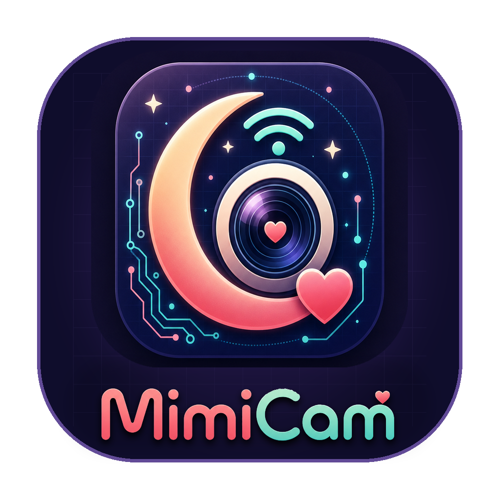
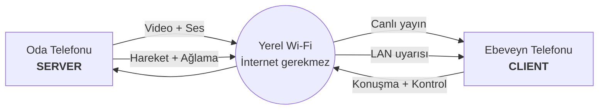

<div align="center">
  
  <br />
  

  <h3>Eski telefonunu güvenli ve yerel bir bebek kamerasına dönüştür.</h3>

  <p>
    MimiCam, iki telefonu aynı Wi-Fi ağı üzerinden birbirine bağlayan<br />
    yerel öncelikli bir Flutter bebek monitörüdür.
  </p>

  <p>
    
    
    
    
  </p>

  <p>
    <strong>İnternet yoksa da çalışır.</strong> Hesap, cloud relay, APNs veya FCM gerekmez.
  </p>
</div>

---

## MimiCam Nedir?

MimiCam, bir telefonu bebeğin odasında **Server**, diğer telefonu ebeveynin
elinde **Client** olarak çalıştırır. Cihazlar QR kod, otomatik yerel ağ keşfi
veya manuel IP ile eşleşir; görüntü, ses ve uyarılar doğrudan aynı yerel ağda
taşınır.

| | Oda Telefonu | Ebeveyn Telefonu |
| --- | --- | --- |
| **Rol** | Server | Client |
| **Görev** | Kamera, mikrofon ve analiz | Canlı izleme ve bildirim |
| **Bağlantı** | Yerel HTTP, WebSocket ve opsiyonel WebRTC | Aynı Wi-Fi üzerinden doğrudan bağlantı |
| **Veri** | Cloud'a yüklenmez | Doğrudan oda telefonundan alınır |


```mermaid
flowchart LR
    S["Oda Telefonu<br/><b>SERVER</b>"]
    W(("Yerel Wi-Fi<br/>İnternet gerekmez"))
    C["Ebeveyn Telefonu<br/><b>CLIENT</b>"]

    S -->|"Video + Ses"| W
    W -->|"Canlı yayın"| C
    S -->|"Hareket + Ağlama"| W
    W -->|"LAN uyarısı"| C
    C -->|"Konuşma + Kontrol"| W
    W --> S
```

## Neden MimiCam?

| Yerel ve özel | Gerçek zamanlı | Akıllı uyarılar | Esnek bağlantı |
| --- | --- | --- | --- |
| Medya ev ağından çıkmaz | Düşük gecikmeli ses ve video | Ağlama, yüksek ses ve hareket analizi | QR, Bonjour/NSD ve manuel IP |
| Hesap zorunluluğu yok | Ses öncelikli adaptif kalite | Uygulama içi geçmiş ve yerel bildirim | IPv4, IPv6 ve hotspot desteği |

### Öne Çıkanlar

- Aynı Wi-Fi üzerinde internetsiz çalışma
- Android ve iOS için ayrı Server/Client rolleri
- QR kod ile hızlı ve güvenli eşleşme
- MJPEG video ve canlı PCM16LE/WAV ses
- Opsiyonel tek eşli H.264 + Opus WebRTC pilotu
- Ağlama, yüksek ses, hareket ve ışık değişimi analizi
- `Ses`, `Hareket` ve `Sistem` filtreli bildirim geçmişi
- Tam ekran izleme, gece saati ve `cover` / `contain` görüntü seçenekleri
- Ebeveynden odaya bas-konuş sesi
- Beyaz gürültü, pembe gürültü, yağmur ve yumuşak ninni
- Gece ışığı ve oda konfor kontrolleri
- Zayıf ağ, sıcaklık ve düşük güç durumlarında adaptif kalite
- Tarayıcıdan açılan canlı test ve tanılama paneli

## Nasıl Çalışır?

1. Oda telefonunda MimiCam açılır ve **Server** rolü seçilir.
2. Uygulama bir QR kod ve yerel bağlantı adresi üretir.
3. Ebeveyn telefonunda **Client** rolü seçilir.
4. QR kod taranır, yerel odalar listesinden seçim yapılır veya IP girilir.
5. Tek kullanımlık eşleşme anahtarı doğrulanır ve güvenilir cihaz kaydedilir.
6. Canlı izleme açıldığında video, ses ve uyarı akışları doğrudan LAN üzerinden başlar.

Rol değiştirildiğinde aktif çalışma grafiği tamamen kapatılır ve yeni rol temiz
bir runtime ile açılır. MimiCam aynı cihazda Server ve Client rollerini eş
zamanlı çalıştırmaz.

## Platform Davranışı

MimiCam platform sınırlarını gizlemez. Özellikle iOS kamera erişimi için
uygulanan davranış aşağıdaki gibidir:

| Durum | Android Server | iOS Server |
| --- | --- | --- |
| Uygulama açık | Video, ses, analiz ve LAN uyarıları | Video, ses, analiz ve LAN uyarıları |
| Ekran kilitli | Foreground service ile yayın devam eder | Audio-only moda geçer |
| Kilitte ses/ağlama analizi | Devam eder | Devam eder |
| Kilitte video/hareket analizi | Devam eder | iOS tarafından durdurulur |
| Ön plana dönüş | Yayın korunur | Kamera ve hareket analizi otomatik geri gelir |

iOS Client tarafında oda sesi aktif olarak dinlenirken background audio,
uygulamanın LAN bağlantısını ve yerel bildirim yolunu kilit ekranında korur.
Bu davranış için internet veya push servisi kullanılmaz.

## Hızlı Başlangıç

### Gereksinimler

- Flutter SDK
- Dart `>=3.4.0 <4.0.0`
- Android Studio veya Xcode
- Aynı yerel ağda iki fiziksel cihaz
- Kamera, mikrofon, yerel ağ ve bildirim izinleri

### Çalıştırma

```bash
flutter pub get
flutter run
```

Server ve Client cihazlarını aynı Wi-Fi ağına bağlayın. Ağın internet
bağlantısı olması gerekmez; cihazların birbirini görebilmesi yeterlidir. Guest
network veya AP/client isolation açıksa cihazlar birbirine bağlanamaz.

### Doğrulama

```bash
dart format .
flutter analyze
flutter test
flutter build apk --debug
```

Android debug APK:

```text
build/app/outputs/flutter-apk/app-debug.apk
```

iOS derlemesi macOS ve Xcode gerektirir:

```bash
flutter build ios --debug
```

## Mimari

```text
lib/
├── analysis/                 # Ses, hareket ve uyarı motorları
├── app/                      # Rol seçimi ve uygulama yaşam döngüsü
├── core/                     # Protokol, güvenlik, ağ ve medya modelleri
├── features/
│   ├── client/               # Ebeveyn cihazı runtime ve ekranları
│   ├── server/               # Oda cihazı runtime ve ekranları
│   └── shared/               # Ortak tasarım ve sunum bileşenleri
├── l10n/                     # Çok dilli metinler
└── services/                 # LAN server, keşif, bildirim ve platform servisleri
```

### Medya Yolu

Varsayılan ve uyumluluk odaklı medya yolu:

- Video: `GET /video` üzerinden MJPEG
- Ses: `GET /audio` üzerinden PCM16LE/WAV
- Uyarılar: `GET /ws/events` üzerinden JSON WebSocket
- Kontroller: Yetkili yerel HTTP endpoint'leri

MJPEG tarafında her client için tek elemanlı “en yeni kare” kutusu kullanılır.
Yavaş client'lar eski kareleri biriktirmek yerine atlar. Ses tarafında sabit
20 ms PCM frame'leri, sınırlı gönderim kuyruğu ve adaptif jitter buffer bulunur.
Zayıf bağlantıda ses ve uyarılar video kalitesinden önce korunur.

### WebRTC Pilotu

WebRTC pilotu varsayılan olarak kapalıdır:

```bash
flutter run --dart-define=MIMICAM_WEBRTC_PILOT=true
```

Pilot yalnız yerel ağda host ICE ile çalışır ve tek aktif peer destekler. Server
ve Client tarafında H.264 ile Opus capability kontrolü başarılı olmazsa MimiCam
otomatik olarak MJPEG/WAV yoluna geri döner.

## Güvenlik ve Eşleşme

MimiCam medya trafiğini yerel ağda tutar ancak aynı ağdaki her cihazı güvenilir
kabul etmez.

```text
QR / IP eşleşmesi
  -> tek kullanımlık ve süreli nonce
  -> güvenilir Client token'ı
  -> kısa ömürlü stream token'ı
  -> video ve ses endpoint'lerine yetkili erişim
```

| Veri | Saklama Alanı |
| --- | --- |
| Güvenilir Client token'ı | `flutter_secure_storage` |
| Eşleşme bilgileri | `SharedPreferences` |
| Server token hash'leri | `SharedPreferences` |
| Bildirim geçmişi | `SharedPreferences` |
| Cihaz kimliği | Güvenli depolama |

Trusted token özel ve durum değiştiren endpoint'lerde Bearer auth olarak
kullanılır. `/video` ve `/audio` ayrıca kısa ömürlü stream token'ı ister.

## Uyarılar ve Bildirimler

Server analiz motoru şu olayları üretebilir:

- Ağlama ve yüksek ses
- Hareket ve genel ışık değişimi
- Batarya ve sistem uyarıları

Client olayları hem uygulama içi geçmişe kaydeder hem de izin verildiğinde yerel
OS bildirimi gösterir. Geçmiş ekranındaki filtreler gerçek event tiplerine göre
`Ses`, `Hareket` ve `Sistem` olarak çalışır.

MimiCam varsayılan yapıda APNs, FCM veya push backend kullanmaz. İnternetsiz
Wi-Fi'da bildirim alınabilmesi için iOS Client'ın aktif background audio
oturumuyla LAN event socket'ini koruması gerekir.

## Oda Kontrolleri

| Özellik | Açıklama |
| --- | --- |
| Bas-konuş | Ebeveyn mikrofonunu PCM olarak oda telefonuna gönderir |
| Konfor sesi | Beyaz/pembe gürültü, yağmur ve prosedürel ninni üretir |
| Gece ışığı | Oda cihazındaki ışık durumunu yerel ağdan kontrol eder |
| Kalite raporu | RTT, video, ses, batarya ve reconnect verilerini Server'a yollar |

Bas-konuş başladığında konfor sesi geçici olarak durur; konuşma bitince önceki
konfor sesi devam eder. Ebeveynden odaya video aktarımı henüz desteklenmez.

## Tanılama Paneli

Server çalışırken tarayıcıdan aşağıdaki yerel endpoint'ler kullanılabilir:

| Route | Amaç |
| --- | --- |
| `/test` | Canlı tanılama paneli |
| `/test/status` | Runtime ve kaynak durumu |
| `/test/probe` | Loopback video/ses kanıtı |
| `/test/alert` | Test uyarısı üretme |
| `/test/audio-tone` | Test ses akışı |

Tanılama çıktısı aktif session'ları, medya profilini, cihaz kaynaklarını,
backpressure durumunu ve p50/p95/p99 sürelerini içerir. Telemetri pencereleri
sınırlıdır; uzun yayınlarda belleği sınırsız büyütmez.

## Opsiyonel Özellikler

### Tek Seferlik Yayın Kilidi

Paywall normal geliştirme ve test build'lerinde kapalıdır:

```bash
flutter run --dart-define=MIMICAM_BROADCAST_PAYWALL_ENABLED=true
```

Flag açıldığında mevcut model ilk 2 saat ücretsiz yayın ve ardından tek seferlik
kilit açma sunar. Store ürün kimliği `mimicam_lifetime_unlock_try_300`, yerel
fiyat etiketi `300 TL` olarak tanımlıdır. Store ürünü App Store Connect veya
Play Console üzerinde ayrıca oluşturulmalıdır.

Yerel receipt envelope doğrulaması ham receipt saklamaz; SHA-256 fingerprint ve
doğrulama metadata'sı tutar. Üretim seviyesinde dolandırıcılık direnci için
Apple/Google server-side receipt doğrulaması ayrıca gerekir.

## Testler

Tam regresyon kapısı:

```bash
flutter analyze
flutter test
```

Yüksek değerli odak testleri:

```bash
flutter test test/features/server/media_stream_end_to_end_test.dart
flutter test test/features/client/client_live_audio_pipeline_test.dart
flutter test test/features/client/client_media_stream_supervisor_test.dart
flutter test test/features/server/server_runtime_lifecycle_test.dart
flutter test test/services/platform/platform_runtime_contract_test.dart
flutter test test/features/performance/screen_render_budget_test.dart
```

Fiziksel cihaz senaryoları için
[test matrisi](docs/physical_device_test_matrix.md), medya kararlarının teknik
arka planı için [transport notları](docs/media_transport_algorithms.md)
kullanılabilir.

## Bilinen Sınırlar

- Cloud relay, hesap sistemi ve internet üzerinden uzaktan erişim yoktur.
- HTTPS/WSS henüz yoktur; uygulama güvenilir yerel ağ kapsamındadır.
- iOS ekran kilidinde kamera ve hareket analizi çalışmaz; ses yolu korunur.
- APNs/FCM olmadığı için iOS'ta audio oturumu olmayan tamamen askıya alınmış
  Client'a anlık LAN bildirimi ulaştırılamaz.
- WebRTC pilotu tek peer ile sınırlıdır ve TURN/NAT traversal sunmaz.
- Doğrudan Bluetooth medya aktarımı desteklenmez.
- Ebeveynden odaya konuşma seslidir; video overlay yoktur.
- Store doğrulaması release-grade server receipt doğrulaması içermez.
- Fiziksel cihaz, sıcaklık ve uzun süreli yayın testleri release öncesi ayrıca
  tamamlanmalıdır.

## Teknik Belgeler

- [Fiziksel cihaz test matrisi](docs/physical_device_test_matrix.md)
- [Medya transport algoritmaları](docs/media_transport_algorithms.md)
- [Flutter porting matrisi](docs/kotlin_to_flutter_porting_matrix.md)
- [Kod inceleme notları](docs/code_review_2026-07-10.md)
- [Ekranlar ve kullanım akışları raporu](docs/reports/mimicam_ekranlar_akislar_usecase_raporu.pdf)
- [Çok dilli ekranlar raporu](docs/reports/mimicam_cok_dilli_ekranlar_usecase_raporu.pdf)

---

<div align="center">
  
  <p><strong>MimiCam</strong><br />Yakında, yerel ve senin kontrolünde.</p>
</div>
