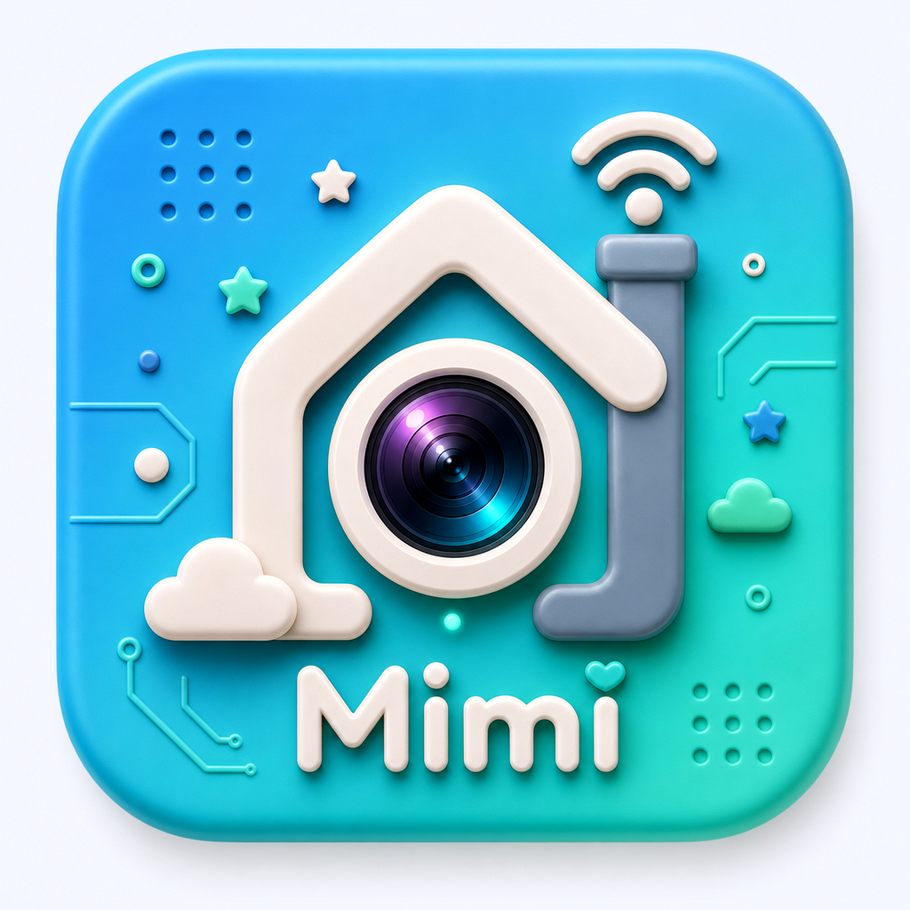
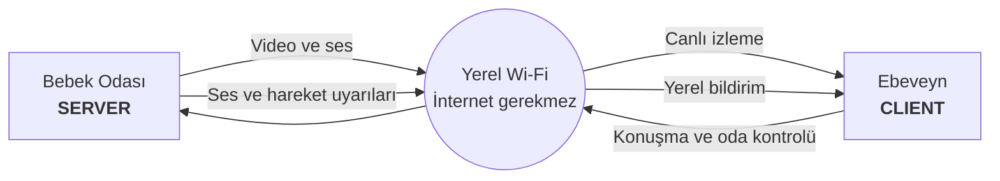

<div align="center">
  
  <br />
  

  <h3>İki telefon. Tek Wi-Fi. Güvenli ve yerel bebek takibi.</h3>

  <p>
    Eski telefonunu bebek odası kamerasına dönüştür;<br />
    görüntüyü, sesi ve uyarıları diğer telefonundan takip et.
  </p>

  <p>
    
    
    
    
  </p>

  <p><strong>Bulut yok. Hesap yok. Aynı ağdaki iki cihaz arasında doğrudan bağlantı.</strong></p>
</div>

---

## MimiCam

MimiCam, aynı yerel ağdaki iki telefonu bağımsız bir bebek monitörü sistemine
dönüştüren Flutter uygulamasıdır. Telefonlardan biri bebek odasında **Server**,
diğeri ebeveynin yanında **Client** olarak çalışır.

İnternet bağlantısı kesilse bile Wi-Fi ağı ayakta olduğu sürece cihazlar
birbirini bulabilir; canlı ses, görüntü, oda kontrolleri ve uyarılar yerel ağ
üzerinden taşınır. APNs, FCM veya cloud relay zorunlu değildir.

| Bebek odası telefonu | Ebeveyn telefonu |
| --- | --- |
| **Server** rolünde çalışır | **Client** rolünde çalışır |
| Kamera ve mikrofonu yayınlar | Canlı görüntü ve sesi oynatır |
| Ses ve hareket analizi yapar | Yerel uyarı ve bildirim üretir |
| QR/IP eşleşmesi sunar | QR, otomatik keşif veya IP ile bağlanır |

## Nasıl Çalışır?


```mermaid
flowchart LR
    S["Bebek Odası<br/><b>SERVER</b>"]
    L(("Yerel Wi-Fi<br/>İnternet gerekmez"))
    C["Ebeveyn<br/><b>CLIENT</b>"]

    S -->|Video ve ses| L
    L -->|Canlı izleme| C
    S -->|Ses ve hareket uyarıları| L
    L -->|Yerel bildirim| C
    C -->|Konuşma ve oda kontrolü| L
    L --> S
```

1. Bebek odasındaki telefonda **Server** rolü seçilir.
2. Ebeveyn telefonunda **Client** rolü seçilir.
3. Cihazlar QR kod, otomatik yerel ağ keşfi veya manuel IP ile eşleştirilir.
4. Canlı yayın açılır; medya ve uyarılar doğrudan LAN üzerinden taşınır.
5. Eşleşen cihaz güvenilir istemci olarak saklanır ve sonraki bağlantılar hızlanır.

## Öne Çıkanlar

| Canlı takip | Akıllı uyarılar | Yerel gizlilik |
| --- | --- | --- |
| Canlı video ve düşük gecikmeli ses | Ağlama, yüksek ses ve hareket analizi | Medya ev ağından çıkmaz |
| Tam ekran izleme | Ses, hareket ve sistem geçmişi | Hesap açmak gerekmez |
| Adaptif yayın kalitesi | Cihaz üzerinde yerel bildirim | Push servisi zorunlu değildir |

### Bağlantı

- QR kod ile hızlı eşleşme
- Bonjour/NSD ile otomatik oda keşfi
- Manuel IP ve port ile bağlantı
- IPv4 ve IPv6 yerel ağ desteği
- Aynı Wi-Fi üzerinde internetsiz çalışma
- Varsayılan MJPEG video ve PCM16LE/WAV ses
- Opsiyonel tek eşli H.264 + Opus WebRTC pilotu

### İzleme ve Oda Kontrolü

- Canlı görüntü ve oda sesi
- Tam ekran izleme ve görüntü ölçekleme seçenekleri
- Ebeveynden odaya bas-konuş sesi
- Beyaz gürültü, pembe gürültü, yağmur ve ninni sesleri
- Gece ışığı ve oda konfor kontrolleri
- Ağ kalitesine göre otomatik yayın uyarlaması
- Canlı durum, gecikme ve bağlantı tanılama bilgileri

### Uyarılar

Bildirim geçmişi işlevsel olarak üç gruba ayrılır:

| Grup | İçerik |
| --- | --- |
| **Ses** | Ağlama, yüksek ses ve ses eşiği olayları |
| **Hareket** | Hareket ve görüntü tabanlı değişim olayları |
| **Sistem** | Bağlantı, yayın ve çalışma durumu olayları |

Filtre seçildiğinde yalnızca ilgili gruptaki kayıtlar gösterilir. Uyarılar
WebSocket ile aynı ağdaki Client cihazına ulaşır ve cihaz üzerinde yerel
bildirime dönüştürülür.

## Platform Davranışı

MimiCam, Android ve iOS'un arka plan kurallarını gizlemez:

| Durum | Android Server | iOS Server |
| --- | --- | --- |
| Uygulama açık | Video, ses ve analiz aktif | Video, ses ve analiz aktif |
| Ekran kilitli | Foreground service ile yayın sürer | Ses yayını ve ses analizi sürer |
| Kilitte hareket analizi | Devam eder | Kamera kısıtı nedeniyle durur |
| Ön plana dönüş | Yayın korunur | Kamera ve hareket analizi geri yüklenir |

iOS Client, oda sesi aktifken background audio oturumuyla LAN bağlantısını ve
yerel uyarı yolunu kilit ekranında korur. Bu mekanizma internet push bildirimi
değildir; iki cihazın aynı erişilebilir yerel ağda kalması gerekir.

## Ürün Akışları

Güncel ürün raporu rol seçimi, eşleşme, Client ekranları, canlı izleme,
bildirim geçmişi, Server operasyonu ve ayar akışlarını kapsar.

<div align="center">
  <a href="docs/reports/mimicam_cok_dilli_ekranlar_usecase_raporu.pdf">
    <strong>Çok Dilli Ekran Görüntüleri ve Use-Case Raporunu Aç</strong>
  </a>
  <br /><br />
  <strong>9 locale</strong> · <strong>126 ekran</strong> · <strong>5 ana use-case</strong>
</div>

Desteklenen arayüz dilleri Türkçe, İngilizce, Çince, İspanyolca, Fransızca,
Almanca, Hintçe ve Arapça locale varyasyonlarını içerir.

## Hızlı Başlangıç

### Gereksinimler

- Flutter SDK
- Dart `>=3.4.0 <4.0.0`
- Android Studio veya Xcode
- Aynı yerel ağda iki fiziksel cihaz

### Kurulum

```bash
flutter pub get
flutter run
```

Uygulamayı iki cihazda açıp birinde **Server**, diğerinde **Client** rolünü
seçin. İlk bağlantı için Server ekranındaki QR kodu tarayın veya gösterilen IP
adresini Client cihazına girin.

### Kalite Kontrolü

```bash
flutter analyze
flutter test
```

iOS Simulator derlemesi:

```bash
flutter build ios --simulator --no-codesign
```

## Mimari

```text
lib/
├── analysis/       # Ses, hareket ve uyarı analizi
├── app/            # Başlatma, rol seçimi ve yaşam döngüsü
├── core/           # Protokol, güvenlik, tema ve ortak modeller
├── features/
│   ├── client/     # Eşleşme, izleme, bildirim ve Client runtime
│   ├── server/     # Yayın, QR, kontroller ve Server runtime
│   └── shared/     # Ortak sunum bileşenleri
├── l10n/           # Çok dilli metin kataloğu
└── services/       # HTTP, WebSocket, medya ve platform servisleri
```

Aktif taşıma modeli local-first'tür:

| Katman | Kullanılan yol |
| --- | --- |
| Kontrol | Yerel HTTP |
| Uyarılar | WebSocket |
| Varsayılan medya | MJPEG + PCM16LE/WAV |
| WebRTC pilotu | H.264 + Opus, tek peer ve otomatik fallback |
| Keşif | DNS-SD/NSD, QR ve manuel IP |
| Yetkilendirme | Trusted Bearer token + kısa ömürlü stream token |

Server ve Client çalışma grafikleri birbirinden ayrıdır. Rol değiştirildiğinde
aktif runtime kapatılır, kaynaklar serbest bırakılır ve yeni rol temiz bir
çalışma grafiğiyle başlatılır.

## Güvenlik

- Eşleşme tek kullanımlık nonce ve kısa ömürlü biletle başlar.
- Başarılı eşleşme sonrasında Client için güvenilir token üretilir.
- Kalıcı depolamada tokenın kendisi yerine hash'i tutulur.
- Medya uçları ayrıca kısa ömürlü stream token ister.
- Özel endpointler yetkisiz yerel ağ isteklerine kapalıdır.
- MimiCam internet erişimi veya kullanıcı hesabı olmadan çalışabilir.

MimiCam internet üzerinden uzaktan erişim sağlamaz. Cloud relay, TURN relay,
hesap backend'i ve doğrudan mobil veri üzerinden bağlantı aktif ürün
kapsamında değildir.

## Opsiyonel Yayın Kilidi

Tek seferlik yayın kilidi varsayılan olarak kapalıdır. Geliştirme sırasında
aşağıdaki derleme bayrağıyla etkinleştirilebilir:

```bash
flutter run \
  --dart-define=MIMICAM_BROADCAST_PAYWALL_ENABLED=true
```

## Dokümantasyon

- [Güncel mimari ve runtime sözleşmesi](ARCHITECT.md)
- [Çok dilli ekran görüntüleri ve use-case raporu](docs/reports/mimicam_cok_dilli_ekranlar_usecase_raporu.pdf)

---

<div align="center">
  
  <p><strong>MimiCam</strong><br />Yakında. Yerel. Senin kontrolünde.</p>
</div>
