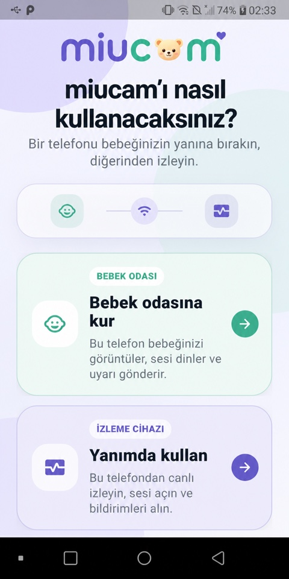
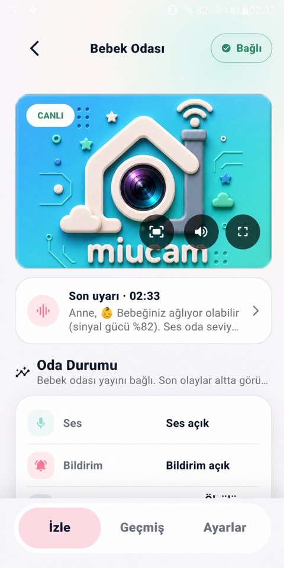
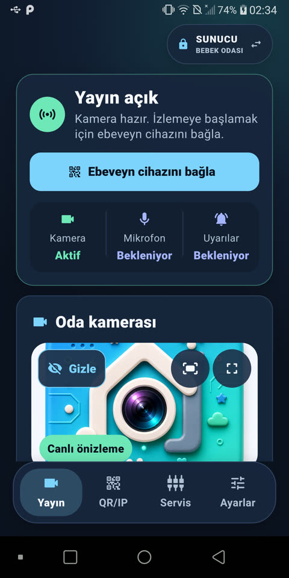
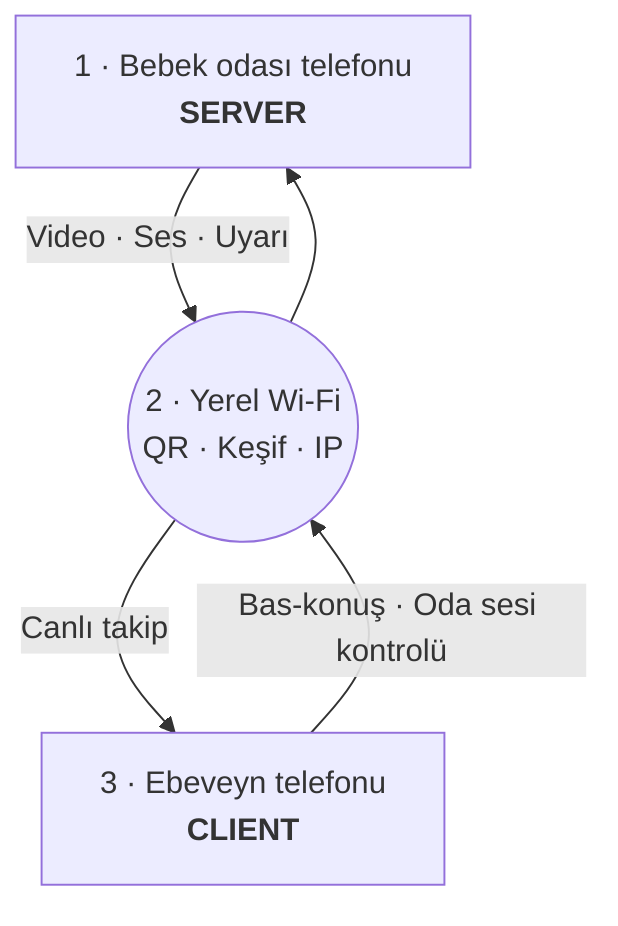
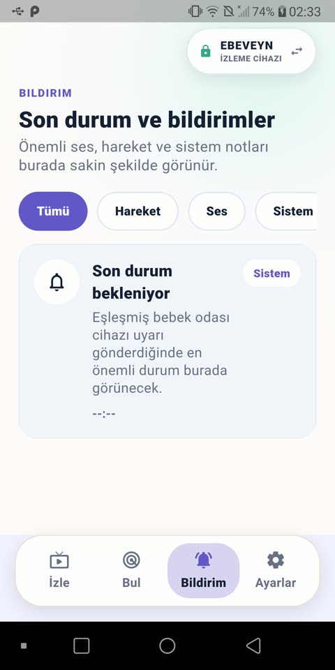
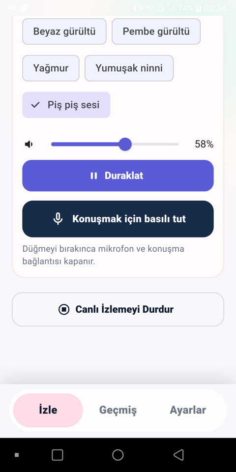
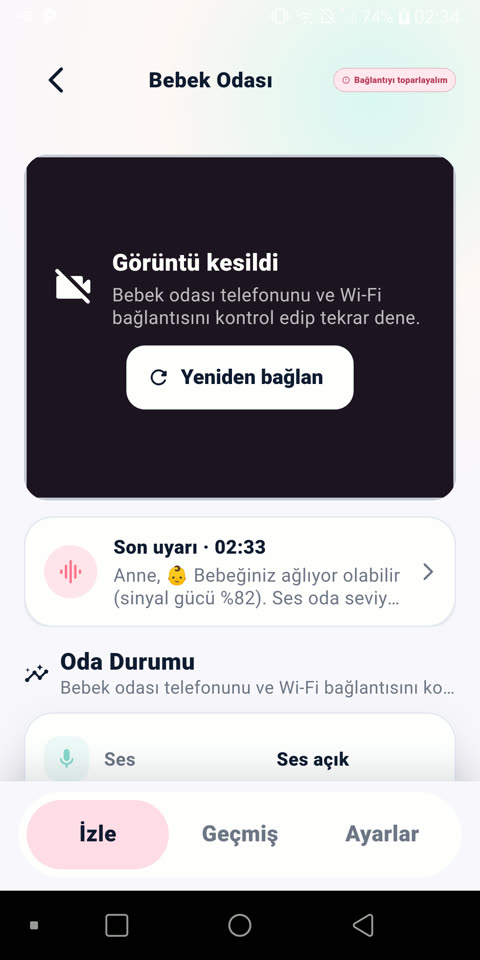

# MiuCam

<div align="center">
  

  <h3>İki telefon. Tek Wi-Fi. Bulutsuz bebek takibi.</h3>

  <p>
    Kullanmadığın telefonu bebek odası cihazına dönüştür.<br />
    Görüntüyü, sesi, uyarıları ve oda kontrollerini yanındaki telefondan takip et.
  </p>

  <p>
    <a href="https://github.com/TunahanCan/babycam/actions/workflows/ios-build.yml"></a>
    
    
    
  </p>

  <p>
    <a href="docs/reports/miucam_cok_dilli_ekranlar_usecase_raporu.pdf"><strong>📱 Ekranları ve use-case'leri gör</strong></a>
    &nbsp;·&nbsp;
    <a href="ARCHITECT.md"><strong>🏗️ Mimariyi incele</strong></a>
    &nbsp;·&nbsp;
    <a href="docs/RELEASE_CHECKLIST.md"><strong>✅ Ürün durumuna bak</strong></a>
  </p>

  <p><strong>Hesap yok · Cloud relay yok · Zorunlu internet yok</strong></p>
</div>

---

## Eski telefonun yeni görevi

MiuCam, aynı yerel ağdaki iki telefonu tek bir bebek takip deneyiminde
buluşturan Flutter uygulamasıdır. Bebek odasındaki telefon **Server**, ebeveynin
yanındaki telefon **Client** olur.

- Server kamera, mikrofon, hareket ve ses analizini yönetir.
- Client canlı görüntüyü ve oda sesini oynatır, uyarıları gösterir.
- Cihazlar QR kod, otomatik yerel ağ keşfi veya manuel IP ile eşleşir.
- Video, ses ve kontrol trafiği doğrudan aynı Wi-Fi üzerinde taşınır.

> [!NOTE]
> MiuCam internet üzerinden uzaktan erişim ürünü değildir. İki cihazın aynı
> erişilebilir yerel ağda kalması gerekir.

## Gerçek uygulama ekranları

<table>
  <tr>
    <td align="center" width="33%"></td>
    <td align="center" width="33%"></td>
    <td align="center" width="33%"></td>
  </tr>
  <tr>
    <td align="center"><strong>Rolünü seç</strong><br /><sub>Bebek odası veya izleme cihazı</sub></td>
    <td align="center"><strong>Canlı takip et</strong><br /><sub>Görüntü, ses, son uyarı ve bağlantı durumu</sub></td>
    <td align="center"><strong>Yayını yönet</strong><br /><sub>Kadraj kontrolü, QR/IP, servis ve ayarlar</sub></td>
  </tr>
</table>

## Üç adımda çalışır


```mermaid
flowchart TB
    A["1 · Bebek odası telefonu<br/><b>SERVER</b>"]
    B(("2 · Yerel Wi-Fi<br/>QR · Keşif · IP"))
    C["3 · Ebeveyn telefonu<br/><b>CLIENT</b>"]

    A -->|Video · Ses · Uyarı| B
    B -->|Canlı takip| C
    C -->|Bas-konuş · Oda sesi kontrolü| B
    B --> A
```

1. Bir telefonda **Bebek odasına kur** seçilir ve gerekli izinler verilir.
2. Diğer telefonda **Yanımda kullan** seçilir; Server'ın QR kodu okutulur.
3. Client ekranından canlı yayın açılır, uyarılar ve oda kontrolleri yönetilir.

## Bir bebek monitöründen beklediğin temel deneyim

### 👀 Canlı takip

- Canlı video ve oda sesi
- Tam ekran izleme, sesi aç/kapat ve görüntüyü sığdırma
- Bağlantı, gecikme ve medya kalitesi için anlaşılır durumlar
- Ağ zayıfladığında adaptif kalite ve kontrollü yeniden bağlanma

### 🔔 Daha anlamlı uyarılar

- Ağlama olasılığı, yüksek ses ve hareket olayları
- Kalibrasyon, episode ve cooldown katmanlarıyla daha az gereksiz tekrar
- Ses, hareket ve sistem geçmişi için çalışan filtreler
- Aynı LAN'daki olayın Client cihazında yerel telefon bildirimine dönüşmesi

### 🎙️ Odaya cevap ver

- Basılı tutarak bebeğe konuşma
- Beyaz ve pembe gürültü
- Yağmur ve yumuşak ninni
- **Piş piş** rahatlatma sesi ve uzaktan ses seviyesi kontrolü

### 🔒 Local-first ve yetkilendirilmiş

- Kullanıcı hesabı veya zorunlu backend yok
- Tek kullanımlık pairing nonce ve kısa ömürlü eşleşme bileti
- Güvenilir Client tokenı ve ayrı stream tokenı
- Medya için cloud relay veya TURN zorunluluğu yok

## Yalnız iyi durumda değil, sorun çıktığında da anlaşılır

<table>
  <tr>
    <td align="center" width="33%"></td>
    <td align="center" width="33%"></td>
    <td align="center" width="33%"></td>
  </tr>
  <tr>
    <td align="center"><strong>Uyarı geçmişi</strong><br /><sub>Ses, hareket ve sistem olayları</sub></td>
    <td align="center"><strong>Oda kontrolleri</strong><br /><sub>Rahatlatıcı sesler ve bas-konuş</sub></td>
    <td align="center"><strong>Bağlantı kurtarma</strong><br /><sub>Donmuş kare yerine açık durum ve tek işlemli retry</sub></td>
  </tr>
</table>

## Platform davranışı

MiuCam, Android ve iOS'un farklı arka plan kurallarını kullanıcıdan saklamaz.

| Platform | Server davranışı |
| --- | --- |
| **Android 23+** | Foreground service ile yayın, ses ve analiz OS kuralları içinde sürdürülebilir. |
| **iOS 13+** | Kamera yayını yalnız uygulama ön plandayken devam eder. Oda sesi aktifken arka plan ses yolu, iOS izin verdiği sürece korunabilir; force-quit veya process kill sonrasında devam garantisi yoktur. |

Client bildirimleri APNs/FCM push değildir. Alert WebSocket'inin ulaşılabilir,
uygulama sürecinin çalışır ve işletim sistemi izinlerinin uygun olması gerekir.

## Hızlı başlangıç

### Gereksinimler

- Flutter `3.44.4`
- Dart `>=3.4.0 <4.0.0`
- Android için Java 17 ve Android 23+
- iOS için macOS, Xcode ve iOS 13+
- Aynı Wi-Fi üzerinde iki fiziksel telefon

### Kurulum

```bash
git clone https://github.com/TunahanCan/babycam.git
cd babycam
flutter doctor -v
flutter pub get
flutter devices
```

İki terminal açıp cihazları ayrı ayrı çalıştır:

```bash
# Terminal 1 · Bebek odası telefonu
flutter run -d <server-device-id>

# Terminal 2 · Ebeveyn telefonu
flutter run -d <client-device-id>
```

Server telefonda **Bebek odasına kur**, Client telefonda **Yanımda kullan**
seçeneğine dokun. İlk eşleşme için QR kodu okut; otomatik keşif çalışmıyorsa
Server ekranındaki IP ve portu kullan.

### Sık karşılaşılan bağlantı sorunları

- İki cihazın aynı normal Wi-Fi ağında olduğundan emin ol; guest Wi-Fi veya
  client isolation cihazların birbirini görmesini engelleyebilir.
- VPN'i kapat ve uygulamanın yerel ağ iznini kontrol et.
- Kamera, mikrofon ve bildirim izinleri reddedildiyse sistem ayarlarından aç.
- Otomatik keşif bulunamazsa QR veya manuel IP ile bağlan.
- iOS Server'da canlı kamera için uygulamayı ön planda tut.

## Ürün raporu

Güncel rapor; rol seçimi, eşleşme, Client ve Server ekranları, canlı izleme,
oda kontrolleri, hata kurtarma ve ayar akışlarını fiziksel Android cihazından
alınmış görüntülerle belgeliyor.

<div align="center">
  <a href="docs/reports/miucam_cok_dilli_ekranlar_usecase_raporu.pdf">
    <strong>📄 Çok dilli ekran ve use-case raporunu aç</strong>
  </a>
  <br /><br />
  <strong>153 ekran</strong> · <strong>9 use-case</strong> · <strong>8 dil / 9 locale</strong> · <strong>yaklaşık 20 MB</strong>
</div>

Desteklenen locale'ler: Türkçe, Amerikan İngilizcesi, Çince, Hintçe, İspanyolca,
Fransızca, Almanca, Arapça–Suudi Arabistan ve Arapça–Katar.

## Teknoloji özeti

| Katman | Uygulama yolu |
| --- | --- |
| UI ve runtime | Flutter / Dart |
| Kontrol | Yerel HTTP |
| Uyarılar | WebSocket → cihaz üstü yerel bildirim |
| Varsayılan medya | MJPEG video + PCM16LE/WAV ses |
| WebRTC pilotu | Tek peer H.264 + Opus, otomatik fallback |
| Keşif | QR, DNS-SD/NSD ve manuel IP |
| Yetkilendirme | Pairing nonce, trusted bearer token ve stream token |

> [!IMPORTANT]
> Local-first, uçtan uca şifreleme anlamına gelmez. Mevcut medya ve kontrol
> taşıması aynı LAN üzerinde HTTP/WS kullanır ve tokenlarla yetkilendirilir;
> TLS/E2E şifreleme sağlamaz. MiuCam tıbbi cihaz değildir ve yetişkin
> gözetiminin yerini almaz.

<details>
<summary><strong>Proje yapısı</strong></summary>

```text
lib/
├── analysis/       # Ses, hareket ve uyarı analizi
├── app/            # Başlatma, rol seçimi ve yaşam döngüsü
├── core/           # Protokol, güvenlik, tema ve ortak modeller
├── features/
│   ├── client/     # Eşleşme, izleme, bildirim ve Client runtime
│   ├── server/     # Yayın, QR, kontroller ve Server runtime
│   └── shared/     # Ortak sunum bileşenleri
├── l10n/           # Çok dilli metin kataloğu
└── services/       # HTTP, WebSocket, medya ve platform servisleri
```

Server ve Client çalışma grafikleri ayrıdır. Rol değiştiğinde aktif runtime
kapatılır, medya kaynakları serbest bırakılır ve yeni rol temiz bir çalışma
grafiğiyle başlatılır.

</details>

<details>
<summary><strong>Ücretsiz deneme ve ömür boyu yayın</strong></summary>

Her oda telefonu ses, görüntü ve bildirim takibi için toplam 2 saat ücretsiz
kullanılır. Birden fazla izleyici süreyi katlamaz. Ardından oda telefonundan
tek seferlik satın alma ile ömür boyu yayın açılır; abonelik yoktur. Türkiye
hedef fiyatı 350 TL'dir, ödeme ekranındaki tutar mağazanın yerel ürün fiyatıdır.
Eşzamanlı 5 ebeveyn cihazı sınırı satın alma sonrasında da geçerlidir.

Bu kural normal derlemelerde açıktır. Gerçek ödeme için mağaza ürünü ve güvenilir
HTTPS satın alma doğrulaması yapılandırılmalıdır:

```bash
flutter build appbundle \
  --dart-define=MIUCAM_PURCHASE_VERIFIER_URL=https://YOUR-BACKEND/verify
```

Doğrulama yapılandırılmamışsa ödeme ekranı açılmaz. Ayrıntılar:
[mağaza hazırlığı ve deneme kuralları](docs/broadcast_pricing.md).

</details>

## Kalite kapısı

GitHub Actions; format, analiz, test, Android App Bundle ve unsigned iOS build
adımlarını çalıştırır. Yerelde aynı temel kontroller:

```bash
dart format --output=none --set-exit-if-changed lib test
flutter analyze
flutter test
flutter build apk --debug
```

iOS release build yalnız macOS/Xcode ortamında alınabilir:

```bash
flutter build ios --release --no-codesign
```

## Dokümantasyon

- [Canlı kodla eşleşen mimari ve runtime sözleşmesi](ARCHITECT.md)
- [Production release checklist](docs/RELEASE_CHECKLIST.md)
- [Medya taşıma ve analiz algoritmaları](docs/media_transport_algorithms.md)
- [Fiziksel cihaz test matrisi](docs/physical_device_test_matrix.md)
- [Gizlilik bildirimi taslağı](PRIVACY.md)
- [Çok dilli ekran görüntüleri ve use-case raporu](docs/reports/miucam_cok_dilli_ekranlar_usecase_raporu.pdf)

---

<div align="center">
  
  <p><strong>Yakında. Yerel. Senin kontrolünde.</strong></p>
</div>
