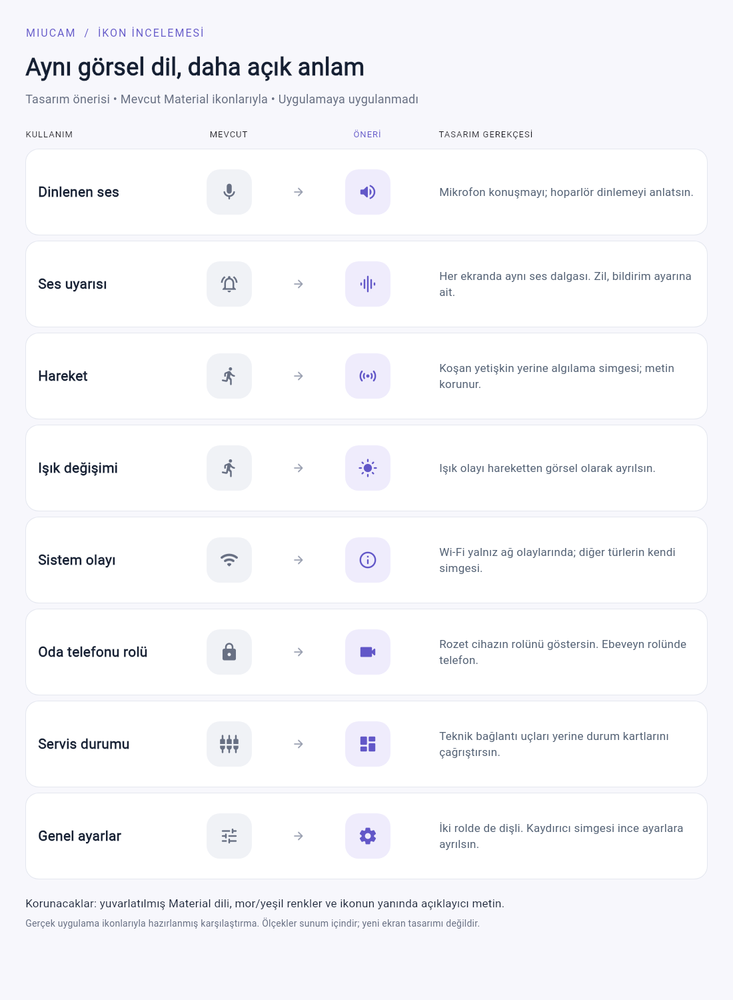

# MiuCam ikon tasarım incelemesi — 27 Eylül 2026

## Karar

Mevcut yuvarlatılmış Material ikon ailesi, uygulamanın yumuşak renkleri ve kartlarıyla uyumlu. Aileyi değiştirmek yerine anlamı karışan simgeler ve ekranlar arasındaki durum eşlemeleri düzeltilmeli. Yeni ikon paketi, bitmap ikonlar veya sürekli animasyon gerekmiyor.

Bu incelemede ürün kodu ve ikonlar değiştirilmedi. Karşılaştırma, mevcut Material glifleriyle hazırlanmış bir tasarım önerisidir; yeni ekran tasarımı değildir.

## Öncelikli bulgular

### 1. Erişilebilirlik: ikon düğmelerinin etkinleştirme eylemi eksik

[`_RoundIconButton`](../../lib/features/client/presentation/watch_stream_surface.dart#L421), `excludeSemantics: true` ile içteki `InkWell` semantiğini kaldırıyor. Dış `Semantics` düğmenin adını ve durumunu tanımlıyor ancak `onTap` tanımlamıyor. Sonuçta erişilebilirlik ağacında düğme var, etkinleştirme eylemi yok.

Gerçek `WatchScreen` widget'ında tam ekran açılarak doğrulandı: tam ekrandan çık, görüntüyü sığdır ve sesi kapat düğümlerinin üçünde de `SemanticsAction.tap` bulunmuyor. Semantik etkinleştirme tam ekrandan çıkmadı; aynı düğmeye pointer tap çıkışı gerçekleştirdi. Bu, görsel tercihlerden önce ele alınması gereken davranış hatasıdır. Dış düğüme `onTap` bağlanmalı ve test, erişilebilirlik eyleminin çalışmasını doğrulayan bir regresyon testine dönüştürülmelidir.

Kanıt: `build/review_2026-09-27/watch_icon_semantics_review_test.dart` ve `build/icon_review_2026-09-27/semantics_review.log`. Testin geçmesi mevcut hatanın yeniden üretildiği anlamına gelir; hata düzeltilmiş değildir. Fiziksel cihazda TalkBack/VoiceOver testi bu tur yapılmadı.

### 2. Kullanıcıya yanlış çağrışım yapan ikonlar

| Kullanım | Mevcut sorun | Öneri |
| --- | --- | --- |
| Dinlenen ses durumu | Mikrofon, ebeveynin konuşma mikrofonunun açık olduğunu düşündürebilir. | Dinleme için `volume_up_rounded` / `volume_off_rounded`; mikrofon konuşma işlevinde kalsın. |
| Ses olayı | Bildirim listesinde zil, canlı son olay kartında ses dalgası var. | Ses olaylarında ortak `graphic_eq_rounded`; zil bildirim bölümü ve bildirim durumu için kullanılsın. |
| Hareket ve ışık değişimi | İkisi de koşan insanla gösteriliyor. | Hareket için metin eşliğinde `sensors_rounded` adayı; ışık için `light_mode_rounded`. Olay türü değerlendirilmeli. |
| Sistem olayları | Pil dahil bütün sistem olayları Wi-Fi simgesi alıyor. | Bağlantıda Wi-Fi, pilde `battery_alert_rounded`, bilinmeyen/genel olayda `info_outline_rounded`. |
| Bildirim durumu | Bildirim kapalıyken de aktif zil gösteriliyor; yalnız renk değişiyor. | Kapalıda `notifications_off_outlined`, yeniden bağlanmada `sync_rounded`, hazırda aktif zil. Metin de korunmalı. |

Kaynaklar: [ses ve bildirim durum satırları](../../lib/features/client/presentation/watch_support_components.dart#L29), [ana bildirim ikon eşlemesi](../../lib/features/client/presentation/client_home_notifications.dart#L105), [canlı son olay kartı](../../lib/features/client/presentation/watch_live_cards.dart#L146). Ana ekranda bildirim durumuna göre yapılan mevcut eşleme, izleme ekranıyla ortaklaştırılabilir.

### 3. İkincil tutarlılık iyileştirmeleri

- **Rol rozeti:** [Sabit kilit](../../lib/features/shared/presentation/miucam_shells.dart#L212) rolü anlatmıyor. Oda telefonu için kamera, ebeveyn telefonu için telefon simgesi daha doğrudan. Rol seçimi ekranındaki mevcut simgeler tekrar kullanılabilir.
- **Genel ayarlar:** [Oda tarafındaki kaydırıcılar](../../lib/features/server/presentation/server_home_components.dart#L17) ve ebeveyn tarafındaki dişli aynı hedefi anlatıyor. Genel ayarlarda ortak dişli; kaydırıcılar algılama ve görüntü ayarlarında kalabilir.
- **Servisler:** Teknik bağlantı uçları yerine durum kartlarını çağrıştıran `dashboard_rounded` değerlendirilebilir. Etiket zaten anlamı desteklediğinden düşük öncelikli.
- **Sığdır / tam ekran:** Yan yana duran `crop_free_rounded` ve tam ekran simgesi benzer köşe işaretleri taşıyor. Doldur için `crop_rounded`, sığdır için `fit_screen_rounded` ayrımı daha belirgin olabilir. İki durum da gerçek video üzerinde kontrol edilmeli.
- **Ses düğmesi kuralı:** Video üzerindeki ikon mevcut ses durumunu, hızlı eylem ikonu yapılacak işlemi gösteriyor. Her ikisi kendi içinde açıklanabilir; aynı işleve tek kural seçilmeli. Durum göstergeleri mevcut durumu, eylem düğmeleri yapılacak işlemi anlatmalı; toggle tasarımı tercih edilirse seçili durum açıkça görünmeli.
- **Yerel bağlantı:** Çevrimdışı durumda bulut üstü çizgi yerine Wi-Fi bağlantısının kesilmesini anlatan simge, yerel ağ kullanımına daha uygun.

## Korunacaklar ve uygulama sınırı

Alt navigasyondaki ikon + yazı, seçili zemin, QR, kamera, oynat/duraklat ve basılı tutarak konuşma simgeleri yerinde. İzleme ekranındaki metinli sekmelere ek ikon koymak gerekmiyor. Video kontrol düğmelerindeki 48 × 48 dokunma alanı korunmalı. Bütün outline ikonlarını filled yapmak gerekmiyor; aynı işlevin farklı ekranlarda aynı görsel ağırlıkta olması yeterli.

Uygulanırken ikon, kategori rengi ve durum eşlemesi UI katmanındaki küçük ortak bir sunum yardımcı sınıfında tutulmalı. Protokol enumlarına veya analiz katmanına Flutter `IconData` taşınmamalı. Bilinmeyen olaylar için genel bilgi simgesi korunmalı; ortak yardımcı olay türünü kategoriye göre öncelikli değerlendirmeli. Boyutlar kullanım amacına göre birkaç tasarım token'ında toplanabilir; mevcut bütün boyutları körlemesine tek sayıya indirmek gerekmiyor.

## İnceleme kapsamı ve doğrulama

- Önceki fiziksel cihaz çalışmasından rol seçimi, keşif, bildirim, canlı izleme, geçmiş, oda kontrolleri, servisler ve ayarlar ekran görüntüleri incelendi (`build/review_2026-09-27/screens/tr/`). Bunlar bu tur yeniden alınmadı.
- Dolu bildirim listesiyle ilgili eşlemeler koddan doğrulandı; incelenen ana bildirim ekranı boş durumdaydı. Canlı önizlemedeki örnek görüntü test içeriğidir, ürün görseli olarak değerlendirilmedi.
- Gerçek ekran widget'ında erişilebilirlik hatasını yeniden üreten 1 test geçti.
- Karşılaştırma görselini gerçek font glifleriyle oluşturan 1 yardımcı render testi geçti ve çıktı görsel olarak kontrol edildi. Bu, uygulamanın davranış testi değildir.
- Ürün kodu değişmediği için tüm uygulama test paketi tekrar çalıştırılmadı. Kullanıcıyla ikon anlam testi yapılmadı; tasarım önerileri uzman değerlendirmesidir.
