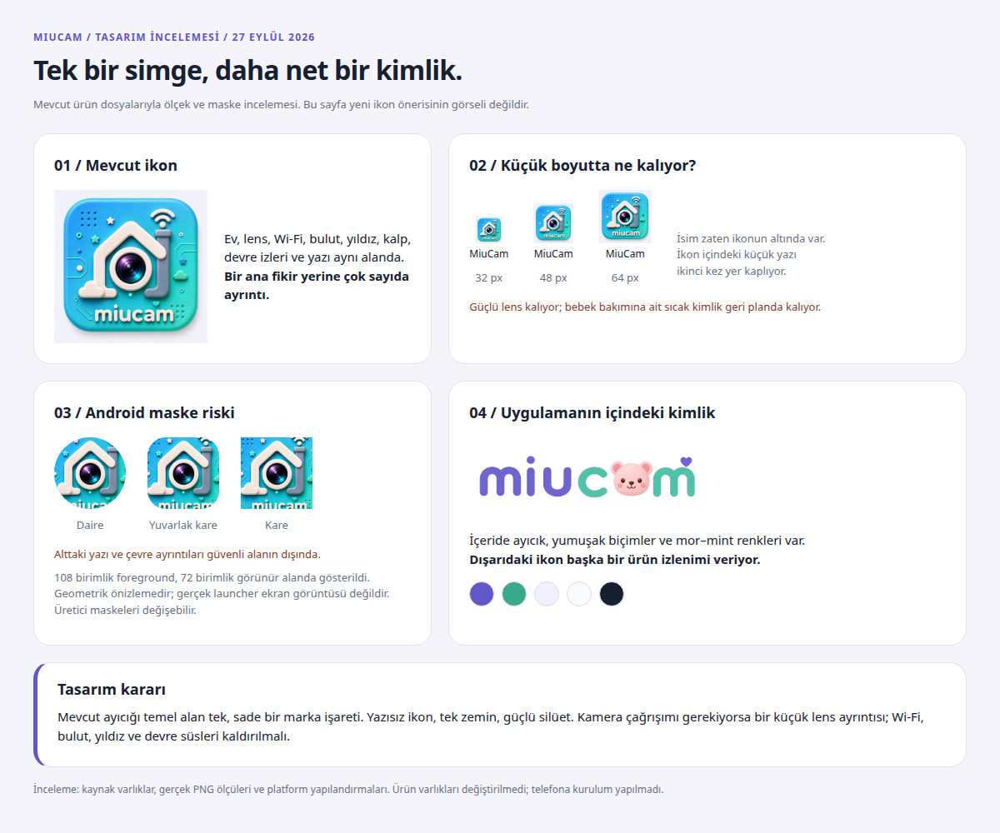

# MiuCam uygulama ikonu ve açılış incelemesi

27 Eylül 2026 · İncelenen kaynak: `c10e9e9`.

## Tasarım kararı

Mevcut ikon kamera işlevini anlatıyor; nihai marka ikonu olarak sadeleştirilmesi
gerekiyor. Küçük ölçekte okunurluk, uygulamanın ayıcıklı kimliğiyle tutarlılık ve
Android maskelerinde güvenli yerleşim öncelikli.

[Tarayıcıda ölçek ve maske karşılaştırması](launcher_icon_review_2026-09-27.html)

## Bulgular

| Öncelik | Bulgu | Etki ve öneri |
| --- | --- | --- |
| Yüksek | Android adaptive foreground tamamen opak, tam kare görsel. | Arka plan katmanını örtüyor; yazı ve çevre ayrıntıları sistem maskelerinde kesilmeye açık. Sembol ile zemin ayrılmalı, sembol güvenli alan içinde kalmalı. |
| Yüksek | Yazı, lens, ev, Wi‑Fi, bulut, yıldız, kalp ve devre izleri birlikte kullanılıyor. | 32–48 px incelemesinde ince ayrıntılar kayboluyor, içerideki marka yazısı okunurluğunu yitiriyor. Yazı kaldırılmalı; tek ana silüet bırakılmalı. |
| Orta | Dış ikon ile uygulama içindeki marka farklı. | Turkuaz, parlak ve ayrıntılı ev kamerası; içerideki ayıcık, mor–mint renkler ve yumuşak biçimlerle aynı görsel dili taşımıyor. Tek marka işareti seçilmeli. |
| Orta | iOS açılış görseli boş. | Üç LaunchImage dosyası da 1×1, tamamen şeffaf piksel. Storyboard beyaz zemin gösteriyor; Android'deki lacivert açılışla tutarsız. Açılış zemini ve ilk uygulama ekranı birlikte tasarlanmalı. |
| Orta | Android 12+ açılışı için ayrı bir tema tanımı yok. | Legacy layer-list'e bağımlı yapı modern sistem açılışını açıkça kontrol etmiyor. Yeni sembol, zemin ve geçiş Android 12+ splash özellikleriyle tanımlanmalı. |
| Düşük | Android monochrome katmanı yok. | Temalı ikon görünümü marka tarafından kontrol edilmiyor. Sade sembolün ayrı tek renk sürümü hazırlanmalı. |

### Kaynak kanıtları

- [Master ikon](../../assets/branding/miucam_launcher_icon.png): 1024×1024 RGB.
- [Adaptive tanımı](../../android/app/src/main/res/mipmap-anydpi-v26/ic_launcher.xml):
  ayrı background/foreground tanımlı; foreground PNG'leri 108/162/216/324/432 px,
  tümü RGB ve opak. Round ikon aynı yapıyı kullanıyor.
- [Uygulama içindeki logo](../../assets/branding/miucam_wordmark_v3.png) ve
  [tasarım renkleri](../../lib/features/shared/presentation/miucam_design_tokens.dart):
  mor `#6257C8`, mint `#39A88B`, açık lavanta `#F2F0FF`.
- [Android açılış zemini](../../android/app/src/main/res/values/colors.xml)
  `#06283F`; [normal pencere](../../android/app/src/main/res/values/styles.xml)
  `#101B31`. Kaynakta `values-v31` veya `windowSplashScreen*` özelleştirmesi yok.
- [iOS storyboard](../../ios/Runner/Base.lproj/LaunchScreen.storyboard)
  beyaz zemin üzerinde [LaunchImage](../../ios/Runner/Assets.xcassets/LaunchImage.imageset)
  kullanıyor. 1x/2x/3x PNG'lerin üçü de 1×1 ve alfa aralığı `(0, 0)`.
- iOS AppIcon boyutları ve Android yoğunluk boyutları doğru. Mevcut sorun dosya
  çözünürlüğü eksikliği değil, çizimin ve katmanların kullanımı.

## Önerilen yön

Uygulamada zaten kullanılan ayıcık temel alınmalı. Yuvarlak ayıcık başı, güçlü
ve sade bir dış çizgiyle tek marka işareti hâline getirilmeli. Kamera çağrışımı
gerekirse küçük, tek bir lens ayrıntısıyla kurulmalı; fotogerçekçi lens halkaları
ve güçlü yansımalar kullanılmamalı. Bu, çizilmesi ve küçük ölçekte değerlendirilmesi
gereken bir tasarım yönüdür; henüz hazırlanmış yeni ikon değildir.

- İkon içinde yazı kullanılmamalı; uygulama adı launcher etiketiyle verilir.
- Mor/lavanta zemin, sıcak açık tonlu sembol ve sınırlı mint vurgu kullanılmalı.
- Wi‑Fi, bulut, yıldız, kalp ve devre dekorları kaldırılmalı.
- Kaynak çizime dış yuvarlak kare, beyaz çerçeve ve dış gölge gömülmemeli;
  platformun şekil ve maske uygulamasına alan bırakılmalı.
- Aynı sembolden Android foreground, monochrome ve iOS ikonları üretilmeli.
- Açılışta statik sembol ve ilk ekranla uyumlu zemin yeterli; markayı göstermek
  için yapay bekleme süresi veya sürekli animasyon eklenmemeli.

Apple da uygulamanın özünü anlatan tek fikri az sayıda biçimle ifade etmeyi
öneriyor. Bu değerlendirmede sadeleştirme yönü mevcut marka ve ölçek incelemesine
dayanan tasarım kararıdır; kullanıcı araştırması sonucu değildir.
[Apple App Icons](https://developer.apple.com/design/human-interface-guidelines/app-icons).

## Platform ölçütleri

Android adaptive ikonunda 108×108 dp katmanlar ve merkezde 66×66 dp güvenli alan
kullanılır; özel monochrome katmanı temalı görünümü kontrol eder. Gömülü dış
maske ve dış gölge kullanılmamalıdır.
[Android adaptive icon rehberi](https://developer.android.com/develop/ui/compose/system/icon_design_adaptive).

Android 12+ splash görünümü sistem tarafından yönetilir; uygulama simgesi ve
zemini ilgili tema özellikleriyle düzenlenir.
[Android splash rehberi](https://developer.android.com/develop/ui/views/launch/splash-screen).

## İncelemenin sınırı

Kaynak görseller doğrudan açıldı; PNG boyutları/alfası ve native yapılandırmalar
incelendi. Karşılaştırma HTML'i Chrome'da oluşturulup görsel olarak kontrol edildi.
Maske örnekleri 108 birimlik foreground'un 72 birimlik görünür alandaki geometrik
önizlemesidir; fiziksel launcher ekran görüntüsü veya tüm üreticiler için birebir
sonuç değildir. 32/48/64 px örnekleri tarayıcıdaki CSS boyutlarıdır.

Bu çalışma tasarım incelemesidir. Ürün ikonları ve açılış kaynakları değiştirilmedi;
cihaza kurulum yapılmadı. Bu nedenle uygulamanın davranış testleri tekrarlanmadı.
