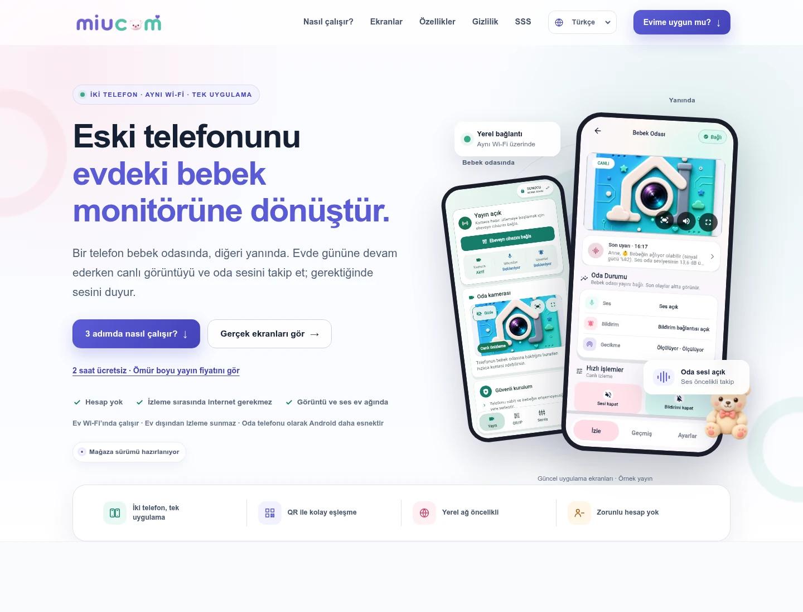

# MiuCam tanıtım sitesi — 27 Eylül 2026

Mevcut marka, renkler ve maskot korundu. Sayfanın ilk ekranı, ürün anlatımı ve
uygulama görselleri güncellendi. Çalışma yerel kaynaklar ve sekiz dilde derlenmiş
statik site üzerinde yapıldı.

## Görsel önizleme

| İlk ekran | Ürün turu | Mobil / RTL |
| --- | --- | --- |
| [Masaüstü](website_refresh_2026-09-27/desktop-hero.webp) | [Canlı takip](website_refresh_2026-09-27/desktop-tour.webp) | [Arapça mobil](website_refresh_2026-09-27/mobile-tour-rtl.webp) |



## Değişiklikler

- İlk ekranın başlığı ve telefon yerleşimi dengelendi. Oda ve ebeveyn
  telefonları etiketleriyle birlikte gösteriliyor; canlı görüntü, oda sesi ve
  gerektiğinde konuşma ebeveynin günlük kullanımından anlatılıyor.
- Kurulum ve ürün ekranları, uygunluk değerlendirmesinden önce geliyor.
  Ziyaretçi önce neyi kullanacağını görüyor; yerel ağ ve platform sınırları
  ilgili bölümlerde korunuyor.
- Küçük, yatay kayan ekran şeridi yerine dört seçilebilir hikâye eklendi:
  canlı takip, oda telefonu, sesini duyurma ve uyarı geçmişi. Her biri güncel
  ekranı daha büyük ve kısa bir fayda açıklamasıyla gösteriyor.
- Altı eski/yeni ekran kaynağı son Flutter kabul görüntülerinden WebP olarak
  üretildi. Görseller gerçek widget'lardan ve örnek yayından oluşuyor; bu bilgi
  ilk ekranda ve galeride görünür. Yapay kullanıcı yorumu veya başarı oranı yok.
- Aile lisansı, ebeveynin App Store / Google Play üzerinden kendi telefonunda
  ödeme yapıp eşleşmiş oda telefonunda kullanmasıyla açıklanıyor. Oda telefonuna
  kart ekleme gerekmiyor. Mağaza sürümünün hazırlanma durumu ve hedef fiyat
  ifadesi korunuyor.
- Yeni anlatım sekiz dile işlendi; 266 anahtar bütün dillerde eşleşiyor.
- Sosyal paylaşım kartı güncel iki telefon ekranıyla yeniden üretildi.
  `website/scripts/social-card.html` düzenlenebilir kaynak, `assets/og-cover.png`
  1200×630 çıktısıdır.

## Kaynak kullanımı ve erişilebilirlik

Yeni çalışma zamanı paketi, haricî font veya üçüncü taraf servis eklenmedi.
Sekmeler kullanıcı eylemiyle değişiyor; otomatik kayan slayt veya timer yok.
Ön yüzdeki mevcut yüksek öncelikli ana ekran görseli korundu; diğer hikâyeler
lazy-load kullanıyor. Altı ekran toplam **174.838 bayt**, her biri 100 KB altında.
Kaynak ve WebP SHA-256 değerleri `website/assets/screens/manifest.json` içinde.

Sekmelerde `tablist` / `tab` / `tabpanel` ilişkisi, seçili durum, tek odak noktası,
ok tuşları ve Home/End var. Arapçada yatay ok yönleri tersine dönüyor.
JavaScript kapalıysa bütün hikâyeler okunabiliyor. Reduced-motion desteği ve
mevcut mobil menü klavye davranışı korunuyor.

## Doğrulama

- Kaynak site: iki sayfa, 21 yerel referans, sekiz katalog doğrulandı.
- Dağıtım çıktısı: **16 yerelleştirilmiş sayfa** doğrulandı; canonical,
  hreflang, metadata, bağlantılar ve HTML fallback metinleri eşleşiyor.
- Chrome: Türkçe masaüstü, İngilizce tablet, Arapça mobil, 320 px Almanca,
  Almanca/Arapça gizlilik ve JavaScript kapalı İngilizce mobil senaryoları.
- **48 dil giriş/geçiş kontrolü**; sekiz dilde 320 px fiyat kartı ve yeni
  ekran/lisans metinlerinin dil değişimi. Fiyat CTA'sı ve doğrudan SSS açılışı.
- Dört ekran seçimi, gerçek görsel yükleme, 390×844 güncel kaynak boyutu,
  LTR/RTL oklar, Home/End, odak, ARIA, gizli panel ve JS kapalı görünüm.
- Yatay taşma, kırık görsel ve JavaScript hatası yok. Dar ekranda %200 yazı
  büyütmeyle eylemler erişilebilir kaldı.
- Masaüstünde ve RTL mobilde dört hikâyenin her biri ayrıca görüntülendi;
  ilk ekran ve güncel sosyal paylaşım kartı görsel olarak incelendi.

Yerel kanıt: `build/website_refresh/final-browser.log` ve
`build/website_refresh/final-browser/`. Tekrar çalıştırma:

```sh
node website/scripts/validate.mjs
node website/scripts/build.mjs build/website_refresh/site
SITE_ROOT=build/website_refresh/site node website/scripts/validate.mjs
python3 -m http.server 8093 --bind 127.0.0.1 --directory build/website_refresh
# Ayrı terminal:
SCREENSHOT_DIR=build/website_refresh/browser \
  node --experimental-websocket website/scripts/browser-smoke.mjs \
  http://127.0.0.1:8093/site/
```

Bu çalışma site kaynaklarını hazırlar. Canlı siteye dağıtım/push yapılmadı;
Safari veya fiziksel iPhone tarayıcı kabulü yapıldığı iddia edilmez.
